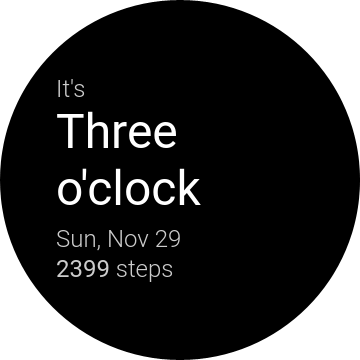

# mnml
a `~ m n m l ~` watch face for Tizen OS.
[Licensed under GNU General Public License v3.0](License)

## Build instructions
1. Get Tizen Studio
2. Get the Samsung certification plugin
3. Set up your author signature
4. Build and install on your device  
